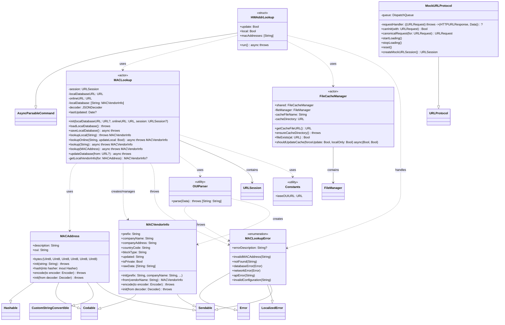

# UML Class Diagram for Swift MAC Lookup

This document provides a UML class diagram representation of the swift-mac-lookup structure.

## Overview

The Swift MAC Lookup project consists of a library for MAC address vendor lookup functionality and a command-line tool that uses this library. The project is structured as a Swift Package with multiple targets.

## Class Diagram



## Package Structure

```
MACLookup Package
├── MACLookup (Library Target)
│   ├── MACAddress
│   ├── MACVendorInfo
│   ├── MACLookupError
│   ├── MACLookup (Actor)
│   └── OUIParser
├── hwaddrlookup (Executable Target)
│   ├── HWAddrLookup
│   └── FileCacheManager
└── MACLookupTests (Test Target)
    └── MockURLProtocol
```

## Key Design Patterns

### 1. Actor Pattern
- **MACLookup**: Uses Swift's actor pattern to ensure thread-safe access to the local database and network operations
- **FileCacheManager**: Manages file system operations in a thread-safe manner

### 2. Error Handling
- **MACLookupError**: Comprehensive error enumeration covering validation, network, and database errors
- Proper error propagation through throwing functions

### 3. Protocol-Oriented Design
- **Codable**: Both `MACAddress` and `MACVendorInfo` conform for JSON serialization
- **Sendable**: All data types are Sendable for safe concurrent usage
- **CustomStringConvertible**: `MACAddress` provides readable string representation

### 4. Separation of Concerns
- **OUIParser**: Dedicated utility for parsing IEEE OUI format
- **FileCacheManager**: Isolated file management logic
- **MockURLProtocol**: Testing infrastructure separated from main code

## Data Flow

1. **Input**: MAC address string → `MACAddress.init(string:)`
2. **Local Lookup**: `MACLookup.lookupLocal()` → checks local database
3. **Online Lookup**: `MACLookup.lookupOnline()` → downloads and parses OUI data via `OUIParser`
4. **Cache Management**: `FileCacheManager` handles local file operations
5. **Output**: `MACVendorInfo` with vendor details

## Dependencies

- **Foundation**: Core framework functionality
- **ArgumentParser**: Command-line interface (external dependency)
- **FoundationNetworking**: Network operations (Linux compatibility)

## Concurrency Model

The project leverages Swift's modern concurrency features:
- **Actors**: `MACLookup` and `FileCacheManager` ensure thread safety
- **Async/Await**: Network operations and file I/O use async patterns
- **Sendable**: All data types are safe for concurrent access

This design provides a robust, thread-safe, and efficient MAC address lookup system with both library and command-line interfaces.